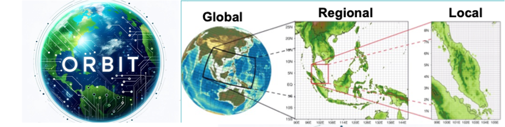

# ORBIT-2: A Foundation Model for the Earth System

<p align="left">
  
</p>

This repository contains code accompanying the paper [**ORBIT-2: Scaling Exascale Vision Foundation Models for Weather and Climate Downscaling**](https://arxiv.org/abs/2301.10343).

## What is ORBIT-2
ORBIT-2 is a scalable foundation model for global, hyper-resolution climate downscaling. ORBIT-2 incorporates two key innovations: (1) Residual Slim ViT (Reslim), a lightweight architecture with residual learning and Bayesian regularization for efficient, robust prediction; and (2) TILES, a tile-wise sequence scaling algorithm that reduces self-attention complexity from quadratic to linear, enabling long-sequence processing and massive parallelism. ORBIT-2 scales to 10 billion parameters across 32,768 GPUs, achieving up to 1.8 ExaFLOPS sustained throughput and 92-98% strong scaling efficiency. It supports downscaling to 0.9 km global resolution and processes sequences up to 4.2 billion tokens. On 7 km resolution benchmarks, ORBIT-2 achieves high accuracy with R^2 scores in the range of 0.98 to 0.99 against observation data.

## Pretraining

### Pretraining on Frontier
To run the pretraining do `sbatch pretrain.lcf`. We provide in the `./config` directories the setup to run 9.5 million, 126 million, 1 billion and 10 billion parameter models. Available training losses include MSE, MAE, latitude weighted MSE, Pearson Score, Anomaly Coefficient. Most recently, hybrid perceptual loss, and bayesian estimation loss with total variation prior. Training losses can be changed in the yaml files.

The expected performance is
<p align="left">
  
</p>

### Pretraining Datasets on Frontier
The pretraining datasets can be found on Frontier 
```
ERA5 5.6 degree "/lustre/orion/lrn036/world-shared/data/superres/era5/5.625_deg/"   
ERA5 1.4 degree "/lustre/orion/lrn036/world-shared/data/superres/era5/1.40625_deg/"  
ERA5 1.0 degree "/lustre/orion/lrn036/world-shared/data/superres/era5/1.0_deg/"  
ERA5 0.25 degree "/lustre/orion/lrn036/world-shared/data/superres/era5/0.25_deg/"   
PRISM 16 km "/lustre/orion/lrn036/world-shared/data/superres/prism/10.0_arcmin"  
PRISM 4 km "/lustre/orion/lrn036/world-shared/data/superres/prism/2.5_arcmin"  
DAYMET 16 km "/lustre/orion/lrn036/world-shared/data/superres/daymet/10.0_arcmin"  
DAYMET 4 km "/lustre/orion/lrn036/world-shared/data/superres/daymet/2.5_arcmin"  
DAYMET 3.5 km "/lustre/orion/lrn036/world-shared/data/superres/daymet/2.0_arcmin"  
DAYMET 800 m "/lustre/orion/lrn036/world-shared/data/superres/daymet/0.5_arcmin"
```

<p align="left">
  
</p>

## Finetuning

### Finetuning on Frontier
To run the pretraining do `sbatch finetuning.lcf`. The expected performance is
<p align="left">
  
</p>

### Finetuning Checkpoints
```
9.5M Model: /lustre/orion/lrn036/world-shared/xf9/downscale_checkpoint/intermediate_8m.ckpt
126M Model: /lustre/orion/lrn036/world-shared/xf9/downscale_checkpoint/intermediate_117m.ckpt
1B Model: /lustre/orion/lrn036/world-shared/xf9/downscale_checkpoint/intermediate_1b.ckpt_rank_*
```

### Finetuning Datasets
<p align="left">
  
</p>
 
 

